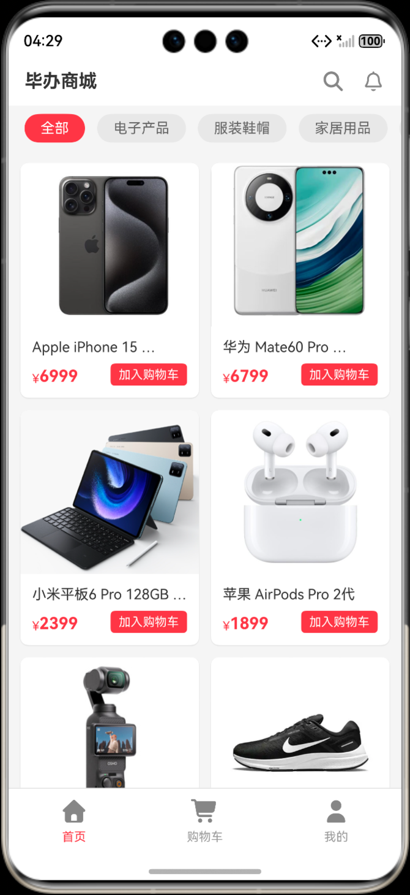
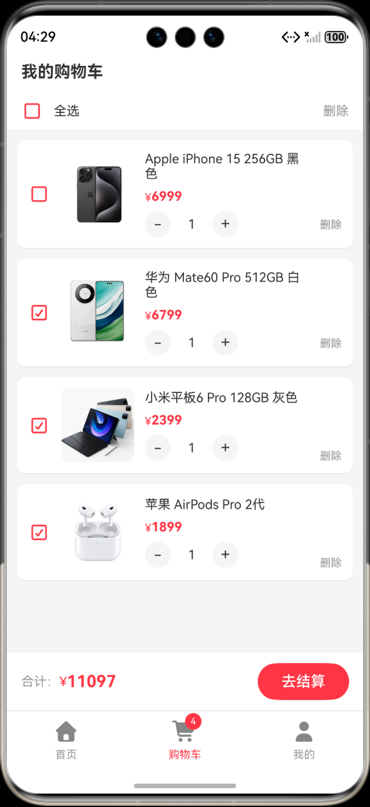
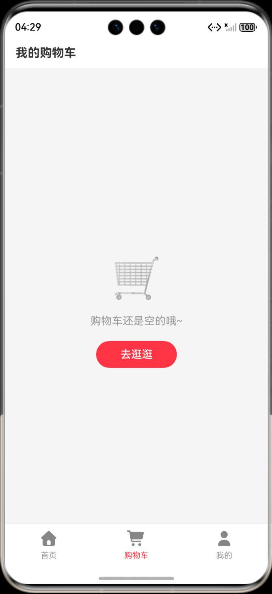
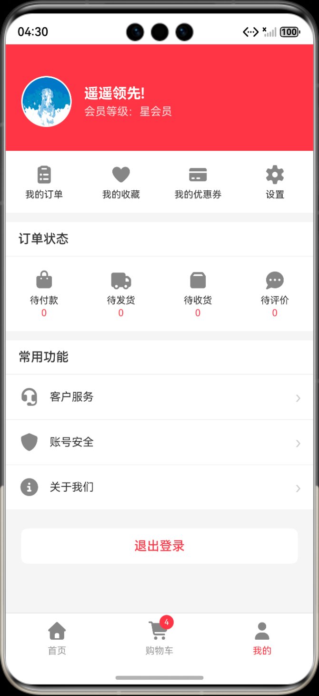
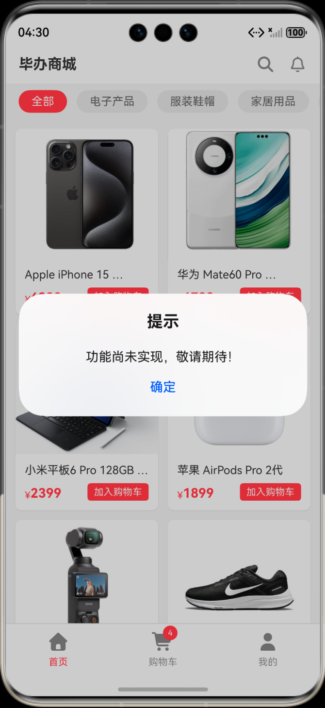

# NIS3366 HarmonyOS MyShoppingApp


## 项目简介

本项目是 NIS3366《项目管理与软件设计》课程设计一的项目，根据课程功能要求，使用HarmonyOS ArkTS 开发一个基于 HarmonyOS 的商城应用。本项目重点使用了 `Scroll`、`List`、`LazyForEach` 组件实现商品列表页面，并完成大部分基础的交互效果。同时，项目还初步实现了商城核心流程：

- 首页商品浏览与分类筛选
- 购物车增删改与价格合计
- 我的页面信息展示
- 底部导航栏页面切换

## 项目结构
```text
NIS3366_HarmonyOS_MyShoppingApp
├─ AppScope/                        # 应用级资源与配置
├─ docs/                            # 课程文档（需求分析、软件设计）
├─ entry/                           # 主模块（页面与业务代码核心）
│  └─ src/main/ets
│  ├─ models/                       # 数据模型定义
│  │  ├─ Product.ets
│  │  ├─ Category.ets
│  │  ├─ CartItem.ets
│  │  └─ UserInfo.ets
│  ├─ pages/                        # 页面层
│  │  ├─ Index.ets
│  │  ├─ HomePage.ets
│  │  ├─ CartPage.ets
│  │  └─ ProfilePage.ets
│  ├─ services/                     # 业务服务层
│  │  ├─ ProductService.ets
│  │  ├─ CategoryService.ets
│  │  ├─ CartService.ets
│  │  └─ UserService.ets
│  └─ utils/                        # 通用组件与工具
│     ├─ BottomNavBar.ets
│     ├─ ProductCard.ets
│     ├─ CartItemCard.ets
│     ├─ ProductDataSource.ets
│     └─ Dialog.ets
├─ image/                           # README 演示截图与图标
├─ hvigor/                          # Hvigor 构建配置
├─ build-profile.json5              # 应用构建配置
├─ hvigorfile.ts                    # 应用级构建入口
└─ oh-package.json5                 # 工程依赖定义
```

## 项目技术栈

- 开发语言：`ArkTS`
- UI 框架：`ArkUI`（声明式 UI）
- 平台：`HarmonyOS`（目标 SDK `6.0.2(22)`）
- 构建系统：`Hvigor`
- 测试依赖：`@ohos/hypium`、`@ohos/hamock`

## 运行方法
- **环境准备**
    - 安装 `DevEco Studio`（建议使用 HarmonyOS NEXT 对应版本）
    - 安装与项目兼容的 HarmonyOS SDK
    - 准备模拟器或真机
- **启动运行**
    - 使用 DevEco Studio 打开项目根目录。
    - 等待索引与依赖同步完成。
    - 选择运行设备（模拟器或真机）。
    - 点击运行按钮启动应用。
- 构建产物
    - 输出目录：`entry/build/default/outputs/`
    - 示例产物：`entry-default-unsigned.hap`

## 界面展示
<div style="text-align: center;">




</div>

初试时购物车为空，点击“去逛逛”按钮将跳转至首页，用户可以浏览商品并添加到购物车。


## 开发说明

- 当前数据以本地模拟数据为主，便于课程演示与功能验证。
- 未实现业务入口统一通过 `Dialog` 组件提示“功能尚未实现，敬请期待！”。
    

## 后续可扩展方向
- 接入真实后端接口与网络请求
- 增加登录鉴权、订单管理、支付流程
- 增加本地持久化（购物车、用户配置）
- 补充自动化测试与 UI 测试

