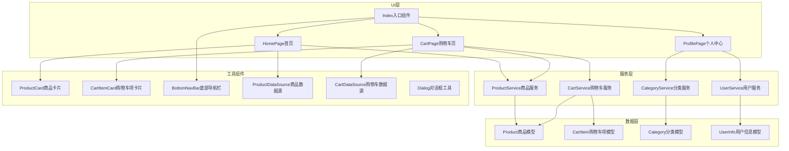
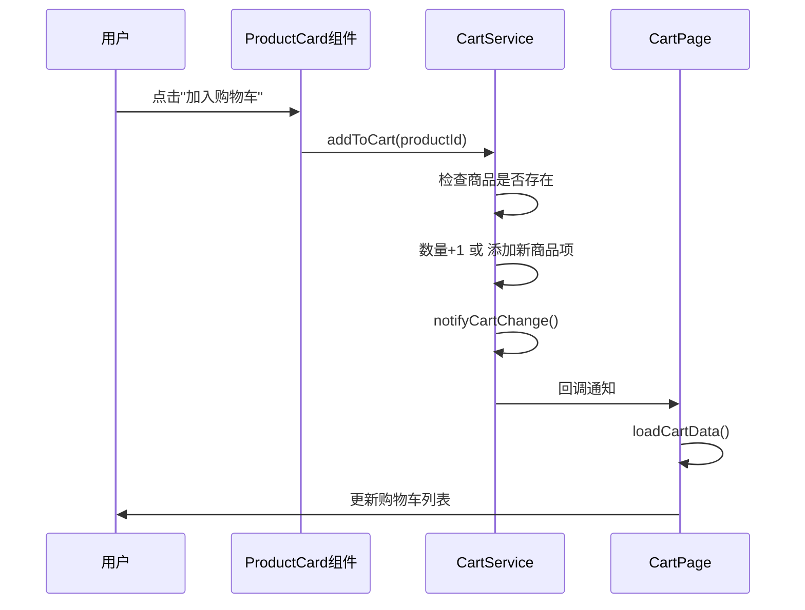

<div align="center" style="margin: 25vh auto; ">

# 毕办商城软件设计文档 <!-- omit in toc -->
<br/>

## NIS3366《项目管理与软件设计》课程设计 <!-- omit in toc -->

<div class="info" style="width: 40%; margin: 20vh auto;">
    <span style="width: 30%; float: left; text-align: right;">姓名：</span>
    <span style="width: 70%; float: left;">马 悦 钊</span>
    <br/>
    <span style="width: 30%; float: left; text-align: right;">学号：</span>
    <span style="width: 70%; float: left;">523031910684</span>
    <br/>
    <span style="width: 30%; float: left; text-align: right;">日期：</span>
    <span style="width: 70%; float: left;">2026-03-15</span>
</div>
</div>

<div style="page-break-after: always;"></div>

## 目录 <!-- omit in toc -->
<div style="display: grid; grid-template-columns: 1fr 1fr; gap: 20px; ">
<div style="break-inside: avoid; border-left: 1px solid #eee; ">

- [<div style="color: #000;">1. 概要设计</div>](#1-概要设计)
    - [<div style="color: #000;">1.1 项目概述</div>](#11-项目概述)
    - [<div style="color: #000;">1.2 设计目标与原则</div>](#12-设计目标与原则)
    - [<div style="color: #000;">1.3 技术选型</div>](#13-技术选型)
- [<div style="color: #000;">2. 系统设计</div>](#2-系统设计)
    - [<div style="color: #000;">2.1 整体架构设计</div>](#21-整体架构设计)
    - [<div style="color: #000;">2.2 模块划分</div>](#22-模块划分)
    - [<div style="color: #000;">2.3 层次结构</div>](#23-层次结构)
    - [<div style="color: #000;">2.4 技术选型说明</div>](#24-技术选型说明)
- [<div style="color: #000;">3. 详细设计</div>](#3-详细设计)
    - [<div style="color: #000;">3.1 数据模型设计</div>](#31-数据模型设计)
    - [<div style="color: #000;">3.2 服务层设计</div>](#32-服务层设计)
    - [<div style="color: #000;">3.3 页面设计</div>](#33-页面设计)
    - [<div style="color: #000;">3.4 工具组件设计</div>](#34-工具组件设计)

</div>
<div style="break-inside: avoid; border-left: 1px solid #eee; ">

- [<div style="color: #000;">4. 接口设计</div>](#4-接口设计)
    - [<div style="color: #000;">4.1 商品服务接口</div>](#41-商品服务接口)
    - [<div style="color: #000;">4.2 购物车服务接口</div>](#42-购物车服务接口)
    - [<div style="color: #000;">4.3 分类服务接口</div>](#43-分类服务接口)
    - [<div style="color: #000;">4.4 用户服务接口</div>](#44-用户服务接口)
- [<div style="color: #000;">5. 非功能性需求设计</div>](#5-非功能性需求设计)
    - [<div style="color: #000;">5.1 性能设计</div>](#51-性能设计)
    - [<div style="color: #000;">5.2 安全性设计</div>](#52-安全性设计)
    - [<div style="color: #000;">5.3 兼容性设计</div>](#53-兼容性设计)
    - [<div style="color: #000;">5.4 可扩展性设计</div>](#54-可扩展性设计)
    - [<div style="color: #000;">5.5 用户体验设计</div>](#55-用户体验设计)
- [<div style="color: #000;">6. 总结</div>](#6-总结)
- [<div style="color: #000;">7. 参考资料</div>](#7-参考资料)

</div>
</div>

<div style="page-break-after: always;"></div>

## 1. 概要设计

### 1.1 项目概述

毕办商城是一款基于 HarmonyOS Next 平台开发的校园电商应用，采用 ArkTS 语言和 ArkUI 声明式 UI 框架进行开发。本应用面向校园用户群体，提供基础的商品浏览、购物车管理、个人中心等核心电商功能。

作为 NIS3366《项目管理与软件设计》课程设计项目，本应用采用本地模拟数据的方式实现，便于课程演示与功能验证。项目在设计上遵循分层架构原则，将 UI 层、业务层和数据层分离，便于后续功能扩展和真实后端 API 的接入。

### 1.2 设计目标

本项目的设计目标包括：

1. **功能完整性**：实现电商应用的核心购物流程，包括商品浏览、分类筛选、购物车管理、订单结算（展示层面）等
2. **用户体验优化**：提供流畅的交互体验，包括下拉刷新、上拉加载、列表懒加载、返回顶部等性能优化
3. **架构合理性**：采用清晰的分层架构（页面层、服务层、数据层/模型层），便于后续功能扩展
4. **技术实践**：熟练掌握 HarmonyOS ArkTS 语言和 ArkUI 声明式 UI 框架


### 1.3 技术选型

本项目采用的技术栈如下：

- **操作系统**：HarmonyOS Next
- **开发语言**：ArkTS
- **UI 框架**：ArkUI
- **开发工具**：DevEco Studio，版本 6.0.2.642
- **目标 SDK**：HarmonyOS 6.0.2 Release SDK，API Version 22 Release

<div style="page-break-after: always;"></div>

## 2. 系统设计

### 2.1 整体架构设计

本应用采用经典的三层架构设计，从上至下依次为：UI 层（页面组件）、服务层（业务逻辑）、数据层（数据模型）。



### 2.2 模块划分

根据功能需求，本应用划分为以下核心模块：

| 模块名称 | 模块职责 | 对应需求 |
|:--------:|:--------:|:--------:|
| 商品浏览模块 | 商品列表展示、分类筛选、搜索入口 | FR-001、FR-002、FR-013 |
| 购物车模块 | 购物车管理、商品数量控制、选中操作、结算 | FR-003、FR-004、FR-005、FR-006、FR-007、FR-008、FR-009 |
| 个人中心模块 | 用户信息展示、功能入口、订单状态 | FR-010 |
| 导航模块 | 底部导航、页面切换、购物车角标 | FR-012 |
| 辅助功能模块 | 返回顶部、消息通知入口、收藏入口、优惠券入口 | FR-011、FR-014、FR-015、FR-016 |

### 2.3 层次结构

本应用的代码目录结构如下：

```
entry/src/main/ets/
├── entryability/
├── models/                     # 数据模型层
│   ├── Product.ets             # 商品模型
│   ├── CartItem.ets            # 购物车项模型
│   ├── Category.ets            # 分类模型
│   └── UserInfo.ets            # 用户信息模型
├── pages/                      # UI页面层
│   ├── Index.ets               # 应用入口组件
│   ├── HomePage.ets            # 首页
│   ├── CartPage.ets            # 购物车页面
│   └── ProfilePage.ets         # 个人中心页面
├── services/                   # 业务服务层
│   ├── ProductService.ets      # 商品服务
│   ├── CartService.ets         # 购物车服务
│   ├── CategoryService.ets     # 分类服务
│   └── UserService.ets         # 用户服务
└── utils/                      # 工具组件层
    ├── ProductCard.ets         # 商品卡片组件
    ├── CartItemCard.ets        # 购物车项卡片组件
    ├── BottomNavBar.ets        # 底部导航栏组件
    ├── ProductDataSource.ets   # 商品数据源
    ├── CartDataSource.ets      # 购物车数据源
    └── Dialog.ets              # 对话框工具
```

### 2.4 技术选型说明

#### 2.4.1 ArkTS 语言特性

本项目充分利用 ArkTS 的以下特性：

- **静态类型检查**：使用 TypeScript 的类型系统，在编译时进行类型检查
- **接口定义**：使用 `interface` 定义数据模型结构
- **单例模式**：服务类使用单例模式确保全局唯一实例
- **装饰器**：使用 `@Component` 装饰器定义 UI 组件

#### 2.4.2 ArkUI 框架特性

本项目充分利用 ArkUI 的以下特性：

- **声明式 UI**：使用 `.method()` 链式调用构建 UI
- **状态管理**：使用 `@State` 装饰器管理组件内部状态
- **属性传递**：使用 `@Prop` 装饰器实现父子组件数据传递
- **LazyForEach**：实现列表数据的懒加载优化
- **Refresh**：实现下拉刷新功能
- **Grid/List**：实现商品列表和购物车列表的网格/列表布局

#### 2.4.3 数据加载优化

- **LazyForEach 懒加载**：商品列表和购物车列表均使用 `LazyForEach` 实现数据懒加载，避免一次性加载所有数据
- **cachedCount 预加载**：设置 `cachedCount(4)` 预加载相邻项，提升滚动体验
- **IDataSource 接口**：实现 `IDataSource` 接口，统一数据管理

<div style="page-break-after: always;"></div>

## 3. 详细设计

### 3.1 数据模型设计

#### 3.1.1 商品模型 Product

```typescript
// 商品数据模型
export interface Product {
  id: number;           // 商品唯一标识
  name: string;         // 商品名称
  price: number;        // 商品价格
  img: string;          // 商品图片资源路径
  category: string;     // 商品所属分类
}
```

#### 3.1.2 分类模型 Category

```typescript
// 分类数据
export interface Category {
  id: string;           // 分类唯一标识
  name: string;         // 分类名称
  isSelected: boolean;  // 是否被选中
}
```

#### 3.1.3 购物车项模型 CartItem

```typescript
import { Product } from './Product';

// 购物车商品项
export interface CartItem {
  product: Product;     // 商品信息
  quantity: number;     // 购买数量
}
```

#### 3.1.4 用户信息模型 UserInfo

```typescript
// 用户信息模型
export interface UserInfo {
  id: string;           // 用户唯一标识
  name: string;         // 用户昵称
  avatar: string;       // 头像资源路径
  memberLevel: string;  // 会员等级
}
```

### 3.2 服务层设计

#### 3.2.1 商品服务 ProductService

商品服务负责管理商品数据，提供商品列表查询和商品详情查询功能。

| 方法名 | 功能描述 | 参数 | 返回值 |
|:------:|:--------:|:-----:|:------:|
| `getInstance()` | 获取单例实例 | 无 | `ProductService` |
| `getProducts(category?: string)` | 获取商品列表 | `category`: 分类筛选（可选） | `Product[]` |
| `getProductById(productId: number)` | 根据 ID 获取商品详情 | `productId`: 商品 ID | `Product` \| `undefined` |

#### 3.2.2 购物车服务 CartService

购物车服务负责管理购物车状态，提供购物车的增删改查功能。

| 方法名 | 功能描述 | 参数 | 返回值 |
|:------:|:--------:|:-----:|:------:|
| `getInstance()` | 获取单例实例 | 无 | `CartService` |
| `addToCart(productId: number)` | 添加商品到购物车 | `productId`: 商品ID | `void` |
| `removeFromCart(productId: number)` | 从购物车移除商品 | `productId`: 商品ID | `void` |
| `updateQuantity(productId: number, quantity: number)` | 更新商品数量 | `productId`: 商品ID, `quantity`: 新数量 | `void` |
| `getCartCount()` | 获取购物车商品总数量 | 无 | `number` |
| `getCartTotal()` | 获取购物车总价 | 无 | `number` |
| `getCartItems()` | 获取购物车商品列表 | 无 | `CartItem[]` |
| `clearCart()` | 清空购物车 | 无 | `void` |
| `onCartChange(callback: () => void)` | 注册购物车变化回调 | `callback`: 回调函数 | `void` |
| `offCartChange(callback: () => void)` | 取消注册回调 | `callback`: 回调函数 | `void` |

购物车服务时序图如下：



#### 3.2.3 分类服务 CategoryService

分类服务负责管理商品分类数据。

| 方法名 | 功能描述 | 参数 | 返回值 |
|:------:|:--------:|:-----:|:------:|
| `getInstance()` | 获取单例实例 | 无 | `CategoryService` |
| `getCategories()` | 获取分类列表 | 无 | `Category[]` |

其中分类数据包括：电子产品、服装鞋帽、家居用品、美妆护肤、食品生鲜五大类，以及一个"全部"分类。

#### 3.2.4 用户服务 UserService

用户服务负责管理用户信息。

| 方法名 | 功能描述 | 参数 | 返回值 |
|:------:|:--------:|:-----:|:------:|
| `getInstance()` | 获取单例实例 | 无 | `UserService` |
| `getUserInfo()` | 获取用户信息 | 无 | `UserInfo` |

### 3.3 页面设计

#### 3.3.1 首页 HomePage

首页是应用的入口页面，承担商品浏览和分类筛选的核心功能。

**页面结构：**
1. **顶部标题栏**：包含应用名称"毕办商城"、搜索图标、消息图标
2. **分类导航**：横向滚动的分类标签，支持点击筛选
3. **商品列表**：双列网格布局的商品展示，支持懒加载
4. **返回顶部按钮**：滚动超过100px时显示的悬浮按钮

**核心功能实现：**

```typescript
// 商品列表 - 使用 Refresh 组件实现下拉刷新，采用 Grid 布局，使用 LazyForEach 实现懒加载
Refresh({ refreshing: this.isRefreshing, offset: 50, friction: 70 }) {
  Grid(this.scroller) {
    LazyForEach(
      this.dataSource,
      (product: Product) => {
        GridItem() {
          ProductCard({ product: product })
        }
      },
      (product: Product) => product.id.toString(),
    )
  }
  .columnsTemplate("1fr 1fr")
  .columnsGap(12)
  .rowsGap(12)
  .cachedCount(4)
}
```

**关键交互：**
- 下拉刷新：触发 `onRefresh()` 方法，重新加载数据
- 分类切换：点击分类标签，筛选对应分类商品，滚动到顶部
- 返回顶部：点击悬浮按钮，平滑滚动到列表顶部

#### 3.3.2 购物车页面 CartPage

购物车页面负责展示和管理用户添加的商品。

**页面结构：**
1. **标题栏**：显示"我的购物车"
2. **全选行**：全选/取消全选、删除选中商品
3. **购物车列表**：商品项卡片列表，支持选中、数量控制、删除
4. **结算栏**：显示总价和"去结算"按钮
5. **空状态**：购物车为空时显示跳转至首页的引导

**核心功能实现：**

```typescript
// 购物车列表 - 使用 Refresh 组件实现下拉刷新，采用 List 布局，使用 LazyForEach 实现懒加载
Refresh({ refreshing: this.isRefreshing, offset: 50, friction: 70 }) {
  List({ space: 12, scroller: this.scroller }) {
    LazyForEach(
      this.dataSource,
      (item: CartItem) => {
        ListItem() {
          CartItemCard({
            item: item,
            isSelected: this.selectedItems.has(item.product.id),
            onToggleSelect: (productId: number) => this.onToggleSelect(productId),
            onDecreaseQuantity: (cartItem: CartItem) => this.onDecreaseQuantity(cartItem),
            onIncreaseQuantity: (cartItem: CartItem) => this.onIncreaseQuantity(cartItem),
            onRemoveItem: (cartItem: CartItem) => this.onRemoveItem(cartItem),
          })
        }
      },
      (item: CartItem) => `${item.product.id}-${item.quantity}`,
    )
  }
  .scrollBar(BarState.Auto)
  .cachedCount(4)
  .onScrollIndex((firstIndex: number, lastIndex: number) => {
    this.onCartScrollIndex(firstIndex, lastIndex);
  })
  .onTouch((event: TouchEvent) => {
    this.onListTouch(event);
  })
}
.onRefreshing(() => {
this.onRefresh();
})
```

#### 3.3.3 个人中心页面 ProfilePage

个人中心页面展示用户信息和常用功能入口。页面结构如下：

1. **个人信息区**：头像、昵称、会员等级
2. **功能入口区**：我的订单、我的收藏、我的优惠券、设置
3. **订单状态区**：待付款、待发货、待收货、待评价
4. **常用功能区**：客户服务、账号安全、关于我们
5. **退出登录按钮**

#### 3.3.4 入口组件 Index

入口组件负责管理底部导航和页面切换。

**核心实现：**

```typescript
@Entry
@Component
export struct MainIndex {
  @State currentIndex: number = 0;

  build() {
    Column() {
      // 根据当前索引显示对应页面
      if (this.currentIndex === 0) {
        HomePage();
      } else if (this.currentIndex === 1) {
        CartPage({ onGoShopping: () => { this.currentIndex = 0 } });
      } else {
        ProfilePage();
      }

      // 底部导航栏
      BottomNavBar({
        currentIndex: this.currentIndex,
        onTabChange: (index: number) => { this.currentIndex = index; },
      })
    }
  }
}
```

### 3.4 工具组件设计

#### 3.4.1 商品卡片 ProductCard

商品卡片组件用于展示单个商品的图片、名称、价格和"加入购物车"按钮。核心功能包括：

- 商品图片展示（自适应高度）
- 商品名称（单行省略）
- 价格显示
- 加入购物车按钮（带点击动效）
- 点击加入购物车时调用 CartService

#### 3.4.2 购物车项卡片 CartItemCard

购物车项卡片组件用于展示购物车中的单个商品。核心功能包括：

- 复选框（选中/未选中状态切换）
- 商品图片
- 商品名称（两行省略）
- 价格显示
- 数量控制（+/-按钮）
- 删除按钮

#### 3.4.3 底部导航栏 BottomNavBar

底部导航栏组件提供三个 tab 切换功能。核心功能包括：

- 三个 tab：首页、购物车、我的
- 购物车角标显示商品数量（超过99显示"99+"）
- tab 点击切换页面

#### 3.4.4 数据源类

- **ProductDataSource**：实现 IDataSource 接口，提供商品数据的懒加载管理
- **CartDataSource**：实现 IDataSource 接口，提供购物车数据的懒加载管理

#### 3.4.5 对话框工具 Dialog

提供通用对话框显示功能，用于提示用户信息。核心方法如下：
- `show(message: string)`：显示提示对话框
- `showNotImplemented()`：显示"功能尚未实现"提示

<div style="page-break-after: always;"></div>

## 4. 接口设计

### 4.1 商品服务接口

#### 4.1.1 获取商品列表

```typescript
getProducts(category?: string): Product[]
```

| 参数名 | 类型 | 必填 | 描述 | 返回值类型 | 说明 |
|:------:|:----:|:----:|:-----:|:----------:|:-----:|
| `category` | `string` | 否 | 分类筛选条件，默认返回全部商品 | `Product[]` | 返回商品列表数组 |

#### 4.1.2 根据ID获取商品详情

```typescript
getProductById(productId: number): Product | undefined
```
 
| 参数名 | 类型 | 必填 | 描述 | 返回值类型 | 说明 |
|:------:|:----:|:----:|:-----:|:----------:|:-----:|
| `productId` | `number` | 是 | 商品唯一标识 | `Product` \| `undefined` | 商品详情，若不存在则返回 `undefined` |

### 4.2 购物车服务接口

#### 4.2.1 添加商品到购物车

```typescript
addToCart(productId: number): void
```

| 参数名 | 类型 | 必填 | 描述 |
|:------:|:----:|:----:|:-----:|
| `productId` | `number` | 是 | 要添加的商品唯一标识 |

#### 4.2.2 从购物车移除商品

```typescript
removeFromCart(productId: number): void
```

| 参数名 | 类型 | 必填 | 描述 |
|:------:|:----:|:----:|:-----:|
| `productId` | `number` | 是 | 要移除的商品唯一标识 |

#### 4.2.3 更新商品数量

```typescript
updateQuantity(productId: number, quantity: number): void
```

| 参数名 | 类型 | 必填 | 描述 |
|:------:|:----:|:----:|:-----:|
| `productId` | `number` | 是 | 商品唯一标识 |
| `quantity` | `number` | 是 | 新数量，若<=0则移除商品 |

#### 4.2.4 获取购物车商品数量

```typescript
getCartCount(): number
```

| 返回值类型 | 描述 |
|:----------:|:-----:|
| `number` | 购物车中所有商品的总数 |

#### 4.2.5 获取购物车总价

```typescript
getCartTotal(): number
```

| 返回值类型 | 描述 |
|:----------:|:-----:|
| `number` | 购物车中所有商品的总价 |

#### 4.2.6 获取购物车商品列表

```typescript
getCartItems(): CartItem[]
```

| 返回值类型 | 描述 |
|:----------:|:-----:|
| `CartItem[]` | 购物车商品列表 |

#### 4.2.7 清空购物车

```typescript
clearCart(): void
```

#### 4.2.8 注册购物车变化回调

```typescript
onCartChange(callback: () => void): void
```

| 参数名 | 类型 | 必填 | 描述 |
|:------:|:----:|:----:|:-----:|
| `callback` | `() => void` | 是 | 购物车变化时触发的回调函数 |

### 4.3 分类服务接口

#### 4.3.1 获取分类列表

```typescript
getCategories(): Category[]
```

| 返回值类型 | 描述 |
|:----------:|:-----:|
| `Category[]` | 分类列表数组 |

### 4.4 用户服务接口

#### 4.4.1 获取用户信息

```typescript
getUserInfo(): UserInfo
```

| 返回值类型 | 描述 |
|:----------:|:-----:|
| `UserInfo` | 用户信息对象 |

<div style="page-break-after: always;"></div>

## 5. 非功能性需求设计

### 5.1 性能设计

根据需求文档中的性能要求，本应用在设计上采取了以下性能优化措施：

| 性能指标 | 目标值 | 设计实现 |
|:--------:|:------:|---------|
| 页面启动时间 | ≤3 秒 | 优化组件初始化逻辑，减少不必要的计算 |
| 列表滚动帧率 | 60 fps | 使用 LazyForEach 实现懒加载，减少渲染压力，保证滚动流畅 |
| 列表加载速度 | 20 个商品 ≤1 秒 | 使用 `cachedCount(4)` 预加载相邻项 |
| 用户操作响应 | ≤200ms | UI 状态同步更新，提供即时反馈 |

**具体优化措施：**

1. **列表懒加载**：使用 `LazyForEach` 替代 `ForEach`，实现按需渲染，首屏只渲染可见区域内的列表项
2. **数据预加载**：设置 `cachedCount(4)` 预加载屏幕外相邻的列表项，保证滚动流畅
3. **状态同步更新**：购物车操作后立即更新本地状态，保证 UI 响应及时
4. **下拉刷新优化**：使用 Refresh 组件原生支持的下拉刷新动画，提升用户体验

### 5.2 安全性设计

| 安全需求 | 设计实现 |
|:--------:|---------|
| 本地存储数据加密 | 当前版本使用内存存储，后续可接入鸿蒙安全存储 |
| 敏感信息保护 | 用户信息等数据采用接口定义，便于后续加密处理 |
| XSS 攻击防护 | ArkTS 为编译型语言，天然防御 XSS 攻击 |

> **说明：** 本项目为课程设计演示项目，采用本地模拟数据，暂不涉及真实用户敏感信息的存储和传输。

### 5.3 兼容性设计

| 兼容性需求 | 设计实现 |
|:--------:|---------|
| 目标 SDK 版本 | HarmonyOS 6.0.2 Release SDK |
| 最低兼容SDK版本 | HarmonyOS 5.0 |
| 屏幕适配 | 使用百分比布局和 Flex 布局，适应不同屏幕尺寸 |
| 分辨率适配 | 图片使用 `objectFit: ImageFit.Cover` 自适应 |

**响应式布局设计：**
- 宽度使用 100% 和 flex 布局自适应
- 高度使用 layoutWeight 自动分配
- 图片使用 `objectFit: ImageFit.Cover` 保持比例
- 字体大小使用 sp 单位，跟随系统设置

### 5.4 可扩展性设计

本应用在架构设计上充分考虑了可扩展性：

| 扩展需求 | 设计实现 |
|:--------:|---------|
| 分层架构 | UI 层/服务层/数据层分离，便于独立扩展 |
| 单例模式 | 服务层采用单例模式，便于全局调用和状态管理 |
| 接口驱动 | 数据模型采用接口定义，便于数据结构扩展 |
| API 接入 | 数据层可无缝替换为真实后端 API |

**后续扩展方向：**
- 接入真实后端 API：只需修改服务层获取数据的方式
- 添加新功能：新增服务类和数据模型，不影响现有功能
- 主题切换：支持深色模式，跟随系统设置
- 国际化：字符串资源外部化，便于多语言支持

### 5.5 用户体验设计

| 体验需求 | 设计实现 |
|:--------:|:---------|
| 页面布局美观 | 统一使用 `#ff4d4f` 主题色，遵循 HarmonyOS 设计规范 |
| 交互反馈明确 | 按钮点击有动效反馈，购物车操作有 Toast 提示 |
| 空状态友好 | 购物车为空时显示空状态提示和"去逛逛"按钮 |
| 加载状态提示 | 下拉刷新有 Refresh 动画，到底有提示 Toast |
| 返回顶部 | 滚动超过 100px 时显示悬浮按钮，点击平滑滚动到顶部 |
| 底部导航 | 三个 tab 切换，当前 tab 高亮显示，购物车显示数量角标 |

<div style="page-break-after: always;"></div>

## 6. 总结

本软件设计文档详细阐述了毕办商城应用的技术架构、模块划分、详细设计、接口设计以及非功能性需求设计。通过采用 ArkTS 语言和 ArkUI 框架，本应用实现了以下核心功能：

1. **商品浏览**：使用 Grid 布局和 LazyForEach 实现高性能商品列表展示
2. **分类筛选**：支持 6 个商品分类的快速筛选
3. **购物车管理**：完整的购物车增删改查功能，支持选中操作和总价计算
4. **个人中心**：用户信息展示和常用功能入口
5. **底部导航**：三个主要页面的快速切换

在性能方面，通过懒加载、数据预加载、下拉刷新等优化手段，确保应用达到 60fps 的流畅度和快速响应能力。在可扩展性方面，采用分层架构和单例模式，为后续功能扩展和真实 API 接入奠定了良好基础。

## 7. 参考资料

1. HarmonyOS 官方文档：https://developer.huawei.com/consumer/cn/doc/
2. OpenHarmony Docs：https://gitcode.com/openharmony/docs/tree/OpenHarmony-6.0-Release
3. 项目 GitHub 仓库：https://github.com/youyeyejie/NIS3366_HarmonyOS_MyShoppingApp
