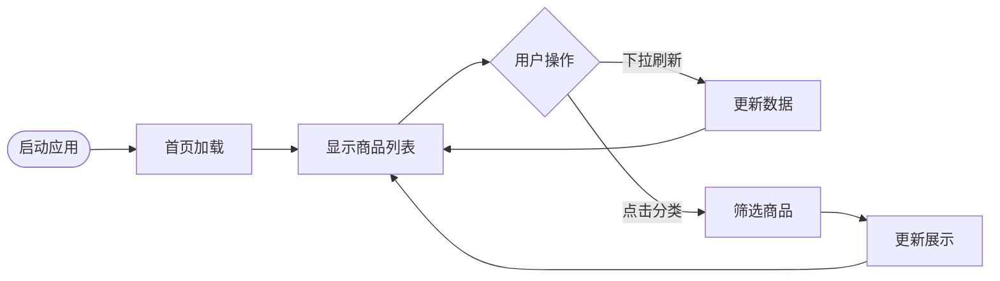
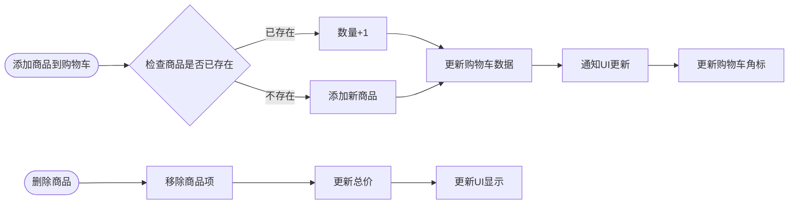
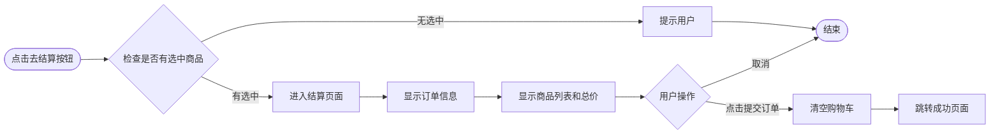
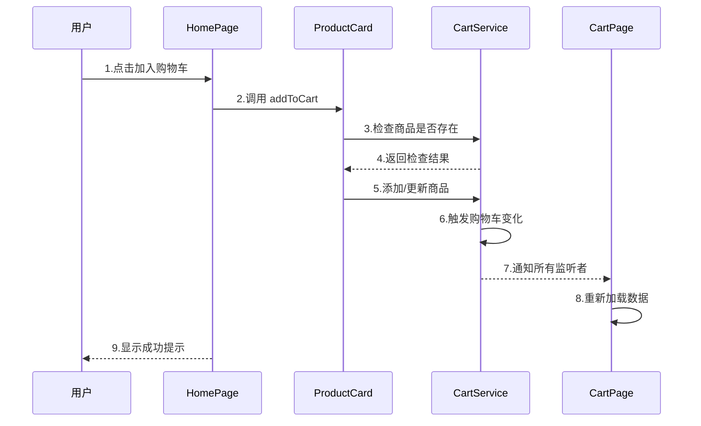
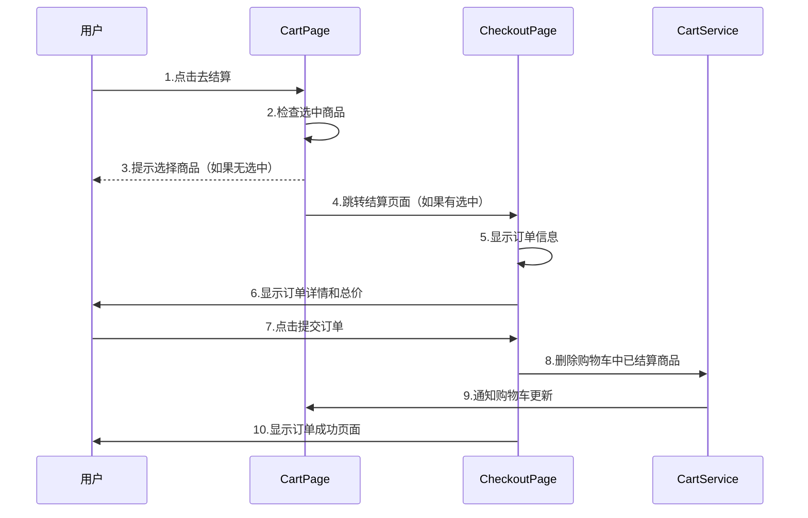

# 毕办商城需求分析文档 <!-- omit in toc -->
 

## NIS3366《项目管理与软件设计》课程设计 <!-- omit in toc -->

    姓名：
    马 悦 钊
     
    学号：
    523031910684
     
    日期：
    2026-03-15

## 目录 <!-- omit in toc -->

- [
1. 项目背景与目标概述
](#1-项目背景与目标概述)
    - [
1.1 项目背景
](#11-项目背景)
    - [
1.2 项目目标
](#12-项目目标)
    - [
1.3 业务场景
](#13-业务场景)
- [
2. 用户画像与用户需求分析
](#2-用户画像与用户需求分析)
    - [
2.1 目标用户画像
](#21-目标用户画像)
    - [
2.2 用户需求分析
](#22-用户需求分析)
- [
3. 现有类似产品调研
](#3-现有类似产品调研)
    - [
3.1 市场主流电商应用分析
](#31-市场主流电商应用分析)
    - [
3.2 本产品差异化定位
](#32-本产品差异化定位)
    - [
3.3 竞品功能对比
](#33-竞品功能对比)
- [
4. 技术要求
](#4-技术要求)
    - [
4.1 开发环境与工具
](#41-开发环境与工具)
    - [
4.2 技术栈要求
](#42-技术栈要求)
    - [
4.3 开发阶段要求
](#43-开发阶段要求)
    - [
4.4 功能实现要求
](#44-功能实现要求)
- [
5. 系统功能需求清单
](#5-系统功能需求清单)
    - [
5.1 核心功能需求 P0
](#51-核心功能需求-p0)
    - [
5.2 重要功能需求 P1
](#52-重要功能需求-p1)
    - [
5.3 辅助功能需求 P2
](#53-辅助功能需求-p2)

- [
6. 非功能需求
](#6-非功能需求)
    - [
6.1 性能要求
](#61-性能要求)
    - [
6.2 安全性要求
](#62-安全性要求)
    - [
6.3 兼容性要求
](#63-兼容性要求)
    - [
6.4 可扩展性要求
](#64-可扩展性要求)
    - [
6.5 用户体验要求
](#65-用户体验要求)
    - [
6.6 可靠性要求
](#66-可靠性要求)
- [
7. 业务流程与时序图
](#7-业务流程与时序图)
    - [
7.1 核心业务流程
](#71-核心业务流程)
    - [
7.2 关键时序图
](#72-关键时序图)
- [
8. 数据模型定义
](#8-数据模型定义)
    - [
8.1 商品模型 Product
](#81-商品模型-product)
    - [
8.2 分类模型 Category
](#82-分类模型-category)
    - [
8.3 购物车项模型 CartItem
](#83-购物车项模型-cartitem)
    - [
8.4 用户信息模型 UserInfo
](#84-用户信息模型-userinfo)
- [
9. 参考资料
](#9-参考资料)

## 1. 项目背景与目标概述

### 1.1 项目背景

本项目是 NIS3366《项目管理与软件设计》课程设计一的项目，旨在使用 HarmonyOS ArkTS 开发一个基于 HarmonyOS Next 的商城应用。随着移动互联网的快速发展，电商应用已成为人们日常购物的主要渠道。HarmonyOS 作为华为自主研发的操作系统，其分布式特性为移动电商应用提供了新的可能性。

本项目以"毕办商城"为产品名称，面向校园用户群体，提供基础的商品浏览、购物车管理、个人中心等核心电商功能。项目采用本地模拟数据的方式实现，便于课程演示与功能验证，同时也为后续接入真实后端 API 提供可能性。

### 1.2 项目目标

本项目的核心目标包括：

1. **功能完整性**：实现电商应用的核心购物流程，包括商品浏览、分类筛选、购物车管理、订单结算等
2. **用户体验优化**：提供流畅的交互体验，包括下拉刷新、上拉加载、列表懒加载等性能优化
3. **架构合理性**：采用清晰的分层架构（页面层、服务层、数据层），便于后续功能扩展
4. **技术实践**：熟练掌握 HarmonyOS ArkTS 语言和 ArkUI 声明式 UI 框架

### 1.3 业务场景

本应用主要服务于以下业务场景：

| 场景 | 描述 | 目标用户 |
|------|------|----------|
| 商品浏览 | 用户在首页浏览商品，可通过分类筛选快速定位目标商品 | 所有用户 |
| 商品详情 | 查看商品详细信息（名称、价格、图片、分类） | 有购买意向的用户 |
| 购物车管理 | 将商品加入购物车，修改数量，删除商品 | 有购买意向的用户 |
| 订单结算 | 选择购物车中的商品进行结算 | 确认购买的用户 |
| 个人中心 | 查看用户信息、订单状态、常用功能入口 | 已登录用户 |

## 2. 用户画像与用户需求分析

### 2.1 目标用户画像

基于项目定位（校园电商应用），本产品的目标用户画像如下：

- 年龄范围：18-25 岁的大学生群体
- 使用习惯：频繁使用手机进行线上购物
- 消费能力：消费金额集中在 100-5000 元区间
- 偏好特征：注重性价比，喜欢浏览电子产品、服装鞋帽等品类
- 技术接受度：对新操作系统（HarmonyOS）有较高接受度

### 2.2 用户需求分析

通过分析目标用户群体，并结合电商应用的基本功能需求，同时考率本产品主要用途为课程设计演示，总结得到以下核心需求：

#### 2.2.1 功能性需求 <!-- omit in toc -->

| 需求编号 | 需求描述 | 优先级 |
|:----------:|----------|:--------:|
| FR-001 | 用户能够浏览商品列表，查看商品名称、价格、图片信息 | 高 |
| FR-002 | 用户能够通过分类筛选商品，快速定位目标品类 | 高 |
| FR-003 | 用户能够将商品添加到购物车 | 高 |
| FR-004 | 用户能够查看购物车中的商品列表 | 高 |
| FR-005 | 用户能够修改购物车中商品的数量 | 高 |
| FR-006 | 用户能够从购物车中删除商品 | 高 |
| FR-007 | 用户能够查看购物车中选中商品的总价 | 高 |
| FR-008 | 用户能够对购物车商品进行选中/取消选中/全选/取消全选操作 | 中 |
| FR-009 | 用户能够选择购物车中选中的商品进行结算 | 中 |
| FR-010 | 用户能够在个人中心查看个人信息和常用功能入口 | 中 |
| FR-011 | 用户能够通过悬浮按钮快速返回顶部 | 中 |
| FR-012 | 应用底部显示导航栏，支持在首页、购物车、个人中心之间切换 | 中 |
| FR-013 | 用户能够通过搜索功能查找商品 | 低 |
| FR-014 | 应用提供消息通知功能，提示用户订单状态等重要信息 | 低 |
| FR-015 | 用户能够收藏商品，方便后续查看 | 低 |
| FR-016 | 应用提供优惠券功能，用户能够查看和使用优惠券 | 低 |

#### 2.2.2 非功能性需求 <!-- omit in toc -->

| 需求编号 | 需求描述 | 优先级 |
|:----------:|----------|:--------:|
| NFR-001 | 页面加载时间不超过 3 秒&emsp;&emsp;&emsp;&emsp;&emsp;&emsp;&emsp;&emsp;&emsp;&emsp;&emsp;&emsp;&emsp;&emsp;&emsp;&emsp;&emsp;&emsp;&emsp;&emsp;&nbsp; | 高 |
| NFR-002 | 列表滚动流畅度达到 60 fps | 高 |
| NFR-003 | 支持 HarmonyOS NEXT 及以上版本 | 高 |
| NFR-004 | 应用安装包大小控制在 50MB 以内 | 中 |
| NFR-005 | 应用能够在不同屏幕尺寸设备上正常显示 | 中 |
| NFR-006 | 用户操作反馈时间不超过 200ms | 中 |

## 3. 现有类似产品调研

### 3.1 市场主流电商应用分析

| 应用名称 | 平台 | 核心功能 | 优势 | 劣势 |
|:----------:|:------:|:----------:|:------:|:------:|
| 淘宝 | Android / iOS / HarmonyOS | 商品浏览、购物车、订单、支付 | 商品品类丰富、用户基数大 | 界面复杂、启动较慢 |
| 京东 | Android / iOS / HarmonyOS | 商品浏览、购物车、订单、支付 | 物流速度快、品质保障 | 界面较为传统 |
| 拼多多 | Android / iOS / HarmonyOS | 商品浏览、社交电商、拼团 | 价格优惠、社交传播 | 界面复杂、质量问题频发 |
| 抖音商城 | Android / iOS / HarmonyOS | 商品直播、短视频电商 | 流量入口、内容电商 | 依赖内容生态 |

### 3.2 本产品差异化定位

相比市场主流电商应用，本产品定位为校园垂直领域的轻量级电商应用。作为课堂设计项目，重点在于实现核心购物流程的功能验证和技术实践，而非追求全面的商业功能。因此，本产品的差异化定位体现在以下几个方面：

1. **轻量化**：专注于基础购物流程，功能简洁，避免过度设计
2. **本地性**：使用本地模拟数据实现功能，便于课程演示和功能验证
3. **学习性**：作为课程项目，重点在于技术实践和功能验证
4. **校园定位**：面向校园用户，提供符合学生消费习惯的商品品类和功能设计
5. **性能优化**：注重页面加载速度和滚动流畅度，提升用户体验

### 3.3 竞品功能对比

| 功能模块 | 淘宝 | 京东 | 拼多多 | 本产品（规划） |
|:----------:|:------:|:------:|:--------:|:--------:|
| 商品浏览 | ✓ | ✓ | ✓ | ✓ |
| 分类筛选 | ✓ | ✓ | ✓ | ✓ |
| 购物车 | ✓ | ✓ | ✓ | ✓ |
| 订单管理 | ✓ | ✓ | ✓ | △ |
| 用户登录 | ✓ | ✓ | ✓ | △ |
| 搜索功能 | ✓ | ✓ | ✓ | △ |
| 支付功能 | ✓ | ✓ | ✓ | ✗ |
| 物流跟踪 | ✓ | ✓ | △ | ✗ |

> 说明：✓ 表示已实现，△ 表示部分实现/待实现，✗ 表示不计划实现

## 4. 技术要求

### 4.1 开发环境与工具

作为课堂演示项目，本项目重点考核学生对 HarmonyOS ArkTS 语言和 ArkUI 声明式 UI 框架的掌握程度，以及对电商应用核心功能的实现能力。因此，本项目开发环境要求如下：

- 目标系统：HarmonyOS Next
- 开发语言：ArkTS
- UI框架：ArkUI 声明式 UI 框架
- 开发工具：DevEco Studio
- 版本控制：Git
- 部署环境：鸿蒙真机设备或模拟器

### 4.2 技术栈要求

本项目技术栈要求包括：

1. **开发语言**：必须使用 ArkTS 语言进行全部开发工作
2. **UI框架**：使用 ArkUI 声明式 UI 框架进行界面开发
3. **组件要求**：使用 Scroll 组件、List 组件以及 LazyForEach 组件实现商品列表页面
4. **数据加载**：利用 LazyForEach 实现列表懒加载，优化性能

### 4.3 开发阶段要求

本项目开发过程应经历以下五个阶段：

1. **分析设计阶段**：完成需求分析，明确功能点和业务流程
2. **绘制商品页面阶段**：使用 ArkUI 组件绘制商品展示页面
3. **加载页面阶段**：实现商品数据的加载与展示
4. **支持列表滑动阶段**：优化列表滑动性能，实现流畅的滚动体验
5. **支持更多品类阶段**：扩展商品分类，完善筛选功能

### 4.4 功能实现要求

功能实现需满足以下要求：

1. **下拉刷新**：商品列表支持下拉刷新功能，更新最新数据
2. **懒加载**：使用 LazyForEach 实现列表数据的懒加载，提升首屏加载速度
3. **到底提示**：列表滚动到底部时显示提示信息，提示用户已加载全部数据

## 5. 系统功能需求清单

本需求文档将功能需求划分为三个优先级：

- P0 优先级：必须实现的核心功能，主要为构成电商应用基础购物流程的必备功能
- P1 优先级：应该实现的重要功能，提升用户体验和完善业务流程的功能
- P2 优先级：可以实现的辅助功能，增强产品竞争力的扩展功能

### 5.1 核心功能需求 P0

#### 5.1.1 商品浏览功能 FR-001 <!-- omit in toc -->

| 需求项 | 详情 |
|:--------:|------|
| **功能描述** | 用户在首页能够浏览商品列表，以网格布局展示每个商品的名称、价格和图片信息 |
| **业务规则** | 1. 商品列表采用双列网格布局 2. 使用 LazyForEach 实现列表懒加载 3. 支持下拉刷新功能 4. 滚动到底部时显示提示 |
| **输入输出** | 输入：无 输出：商品列表数据（包含商品   ID、名称、价格、图片、分类） |
| **异常处理** | 1. 数据加载失败：显示错误提示，提供重试按钮 2. 无商品数据：显示空状态提示 |
| **验收标准** | 1. 首页能够正常加载并显示商品列表 2. 商品图片、名称、价格正确显示 3. 下拉刷新能够触发数据重新加载 4. 滚动流畅，无明显卡顿 |

#### 5.1.2 分类筛选功能 FR-002 <!-- omit in toc -->

| 需求项 | 详情 |
|:--------:|------|
| **功能描述** | 用户能够通过顶部分类导航筛选特定品类的商品 |
| **业务规则** | 1. 分类导航横向滚动显示 2. 支持的分类包括：全部、电子产品、服装鞋帽、家居用品、美妆护肤、食品生鲜 3. 选中分类高亮显示（红色背景） 4. 切换分类后自动滚动到列表顶部 |
| **输入输出** | 输入：选中的分类 ID 输出：筛选后的商品列表 |
| **异常处理** | 1. 分类数据为空：显示默认"全部"分类 2. 分类切换失败：保留当前显示内容 |
| **验收标准** | 1. 分类导航能够横向滚动 2. 点击分类能够正确筛选商品 3. 选中状态视觉反馈正确 4. 切换分类后列表自动滚动到顶部 |

#### 5.1.3 购物车添加功能 FR-003 <!-- omit in toc -->

| 需求项 | 详情 |
|:--------:|------|
| **功能描述** | 用户能够在商品列表页将商品添加到购物车&emsp;&emsp;&emsp;&emsp;&emsp;&emsp;&emsp;&emsp;&emsp;&emsp;&emsp;&emsp;&emsp;&emsp;&emsp;&emsp;&emsp;&emsp;&emsp;&emsp;&nbsp; |
| **业务规则** | 1. 点击商品卡片上的"加入购物车"按钮添加 2. 如果商品已存在于购物车中，则数量加一 3. 添加成功后显示成功提示 4. 购物车数量角标实时更新 |
| **输入输出** | 输入：商品 ID 输出：购物车状态更新结果 |
| **异常处理** | 1. 添加失败：显示错误提示 2. 商品不存在：显示商品不存在提示 |
| **验收标准** | 1. 点击"加入购物车"按钮能够添加商品 2. 重复添加同一商品，数量正确累加 3. 添加成功有视觉/Toast反馈 4. 底部导航栏购物车图标角标数量正确 |

#### 5.1.4 购物车查看功能 FR-004 <!-- omit in toc -->

| 需求项 | 详情 |
|:--------:|------|
| **功能描述** | 用户能够查看购物车中已添加的所有商品&emsp;&emsp;&emsp;&emsp;&emsp;&emsp;&emsp;&emsp;&emsp;&emsp;&emsp;&emsp;&emsp;&emsp;&emsp;&emsp;&emsp;&emsp;&emsp;&emsp;&emsp;&nbsp; |
| **业务规则** | 1. 购物车页面展示商品列表 2. 每个商品项显示：商品图片、名称、价格、数量 3. 购物车为空时显示空状态提示和"去逛逛"按钮 4. 支持下拉刷新 |
| **输入输出** | 输入：无 输出：购物车商品列表数据 |
| **异常处理** | 1. 购物车为空：显示空状态页面 2. 数据加载失败：显示错误提示 |
| **验收标准** | 1. 购物车页面正确显示所有已添加商品 2. 空购物车显示空状态提示 3. 点击"去逛逛"能够跳转到首页 4. 下拉刷新能够重新加载数据 |

#### 5.1.5 购物车数量修改功能 FR-005 <!-- omit in toc -->

| 需求项 | 详情 |
|:--------:|------|
| **功能描述** | 用户能够增加或减少购物车中商品的数量&emsp;&emsp;&emsp;&emsp;&emsp;&emsp;&emsp;&emsp;&emsp;&emsp;&emsp;&emsp;&emsp;&emsp;&emsp;&emsp;&emsp;&emsp;&emsp;&emsp;&emsp;&nbsp; |
| **业务规则** | 1. 每个商品项显示"+"和"-"按钮 2. 点击"+"按钮数量加一 3. 点击"-"按钮数量减一 4. 当数量减少到 0 时，自动从购物车中移除该商品 |
| **输入输出** | 输入：商品ID、操作类型（增加/减少） 输出：更新后的购物车状态 |
| **异常处理** | 1. 数量修改失败：显示错误提示，保持原数量 2. 数量为 0 时自动移除商品 |
| **验收标准** | 1. 点击"+"按钮数量正确增加 2. 点击"-"按钮数量正确减少 3. 数量为 0 时商品自动移除 4. 总价实时更新 |

#### 5.1.6 购物车删除功能 FR-006 <!-- omit in toc -->

| 需求项 | 详情 |
|:--------:|------|
| **功能描述** | 用户能够从购物车中删除单个商品或批量删除选中商品&emsp;&emsp;&emsp;&emsp;&emsp;&emsp;&emsp;&emsp;&emsp;&emsp;&emsp;&emsp;&emsp;&emsp; |
| **业务规则** | 1. 单个商品支持左滑删除 2. 底部显示"删除"按钮用于批量删除 3. 删除选中商品后自动更新总价 |
| **输入输出** | 输入：商品 ID 或商品 ID 列表 输出：删除后的购物车状态 |
| **异常处理** | 1. 删除失败：显示错误提示 2. 无选中商品时点击删除无响应 |
| **验收标准** | 1. 能够删除单个商品 2. 能够批量删除选中的商品 3. 删除后总价正确更新 4. 删除后列表自动刷新 |

#### 5.1.7 购物车总价计算功能 FR-007 <!-- omit in toc -->

| 需求项 | 详情 |
|:--------:|------|
| **功能描述** | 购物车底部实时显示选中商品的总价&emsp;&emsp;&emsp;&emsp;&emsp;&emsp;&emsp;&emsp;&emsp;&emsp;&emsp;&emsp;&emsp;&emsp;&emsp;&emsp;&emsp;&emsp;&emsp;&emsp;&emsp;&emsp;&emsp;&nbsp;&nbsp; |
| **业务规则** | 1. 总价 = Σ(商品单价 × 商品数量) 2. 仅计算被选中状态的商品 3. 总价保留两位小数 |
| **输入输出** | 输入：购物车商品列表、选中状态 输出：总价数值 |
| **异常处理** | 1. 购物车为空时显示总价为 0 2. 计算异常显示为 0 |
| **验收标准** | 1. 选中商品变化时总价实时更新 2. 总价计算结果正确 3. 底部结算栏正确显示总价 |

### 5.2 重要功能需求 P1

#### 5.2.1 商品选中功能 FR-008 <!-- omit in toc -->

| 需求项 | 详情 |
|:--------:|------|
| **功能描述** | 用户能够选中或取消选中购物车中的商品，用于批量结算&emsp;&emsp;&emsp;&emsp;&emsp;&emsp;&emsp;&emsp;&emsp;&emsp;&emsp;&emsp;&emsp; |
| **业务规则** | 1. 每个商品项有复选框用于选中/取消选中 2. 顶部显示"全选"按钮 3. 全选按钮点击切换全选/全不选状态 4. 选中商品变化时重新计算总价 |
| **输入输出** | 输入：商品 ID 输出：选中状态集合 |
| **异常处理** | 选中状态异常时重置为默认未选中 |
| **验收标准** | 1. 点击复选框能够切换选中状态 2. 点击全选能够切换全选/全不选 3. 选中变化时总价正确更新 |

#### 5.2.2 订单结算功能 FR-009 <!-- omit in toc -->

| 需求项 | 详情 |
|:--------:|------|
| **功能描述** | 用户能够选择购物车中选中的商品进行结算&emsp;&emsp;&emsp;&emsp;&emsp;&emsp;&emsp;&emsp;&emsp;&emsp;&emsp;&emsp;&emsp;&emsp;&emsp;&emsp;&emsp;&emsp;&emsp;&emsp;&nbsp; |
| **业务规则** | 1. 点击"去结算"按钮进入结算流程 2. 结算页面显示选中商品的订单信息 3. 本版本仅展示结算页面，不包含实际支付功能 |
| **输入输出** | 输入：选中的商品列表 输出：订单信息 |
| **异常处理** | 1. 未选中商品时点击结算提示"请选择要结算的商品" 2. 结算页面加载失败显示错误提示 |
| **验收标准** | 1. 有选中商品时点击"去结算"能够进入结算页面 2. 无选中商品时点击"去结算"有提示 3. 结算页面显示正确的商品信息和总价 |

#### 5.2.3 个人中心功能 FR-010 <!-- omit in toc -->

| 需求项 | 详情 |
|:--------:|------|
| **功能描述** | 用户能够在个人中心页面查看个人信息和常用功能入口&emsp;&emsp;&emsp;&emsp;&emsp;&emsp;&emsp;&emsp;&emsp;&emsp;&emsp;&emsp;&emsp;&emsp;&nbsp; |
| **业务规则** | 1. 顶部显示用户头像、用户名、会员等级 2. 功能入口区显示：我的订单、我的收藏、我的优惠券、设置 3. 订单状态区显示：待付款、待发货、待收货、待评价 4. 常用功能区显示：客户服务、账号安全、关于我们 5. 底部显示"退出登录"按钮 |
| **输入输出** | 输入：无 输出：用户信息、功能菜单列表 |
| **异常处理** | 用户未登录时显示游客状态 |
| **验收标准** | 1. 个人中心页面正确显示用户信息 2. 各功能入口正确显示 3. 点击功能入口有相应响应 |

#### 5.2.4 返回顶部功能 FR-011 <!-- omit in toc -->

| 需求项 | 详情 |
|:--------:|------|
| **功能描述** | 当商品列表滚动较远时，用户能够通过悬浮按钮快速返回顶部&emsp;&emsp;&emsp;&emsp;&emsp;&emsp;&emsp;&emsp;&emsp;&emsp;&nbsp;&nbsp; |
| **业务规则** | 1. 当滚动距离超过 100px 时显示返回顶部按钮 2. 点击按钮触发平滑滚动到顶部 3. 滚动到顶部后按钮自动隐藏 |
| **输入输出** | 输入：无 输出：无 |
| **异常处理** | 滚动到顶部过程异常不影响使用 |
| **验收标准** | 1. 滚动超过 100px 时按钮显示 2. 点击按钮能够平滑滚动到顶部 3. 到达顶部后按钮隐藏 |

#### 5.2.5 底部导航功能 FR-012 <!-- omit in toc -->

| 需求项 | 详情 |
|:--------:|------|
| **功能描述** | 应用底部显示导航栏，支持在首页、购物车、个人中心之间切换&emsp;&emsp;&emsp;&emsp;&emsp;&emsp;&emsp;&emsp;&emsp;&nbsp; |
| **业务规则** | 1. 导航栏包含三个 tab：首页、购物车、个人中心 2. 每个 tab 有对应的图标和文字 3. 当前页面 tab 高亮显示 4. 购物车 tab 显示商品数量角标 |
| **输入输出** | 输入：tab 点击事件 输出：页面切换 |
| **异常处理** | 页面切换异常时保持当前页面 |
| **验收标准** | 1. 导航栏三个 tab 正确显示 2. 点击 tab 能够切换对应页面 3. 当前 tab 高亮状态正确 4. 购物车数量角标实时更新 |

### 5.3 辅助功能需求 P2

#### 5.3.1 搜索功能 FR-013 <!-- omit in toc -->

| 需求项 | 详情 |
|:--------:|------|
| **功能描述** | 用户能够通过关键词搜索商品&emsp;&emsp;&emsp;&emsp;&emsp;&emsp;&emsp;&emsp;&emsp;&emsp;&emsp;&emsp;&emsp;&emsp;&emsp;&emsp;&emsp;&emsp;&emsp;&emsp;&emsp;&emsp;&emsp;&emsp;&emsp;&emsp;&emsp;&nbsp; |
| **业务规则** | 1. 首页顶部显示搜索图标 2. 点击搜索图标进入搜索页面 3. 用户输入关键词后实时显示搜索结果 4. 本版本仅实现搜索入口和 UI，不包含实际搜索逻辑 |
| **输入输出** | 输入：搜索关键词 输出：搜索结果列表 |
| **异常处理** | 搜索异常显示错误提示 |
| **验收标准** | 1. 点击搜索图标能够进入搜索页面 2. 搜索页面 UI 正确显示 |

#### 5.3.2 消息通知功能 FR-014 <!-- omit in toc -->

| 需求项 | 详情 |
|:--------:|------|
| **功能描述** | 用户能够接收应用推送的消息通知&emsp;&emsp;&emsp;&emsp;&emsp;&emsp;&emsp;&emsp;&emsp;&emsp;&emsp;&emsp;&emsp;&emsp;&nbsp;&emsp;&emsp;&emsp;&emsp;&emsp;&emsp;&emsp;&emsp;&emsp;&emsp;&nbsp;&nbsp; |
| **业务规则** | 1. 首页顶部显示消息铃铛图标 2. 有未读消息时显示红点角标 3. 本版本仅实现入口，不包含实际通知功能 |
| **输入输出** | 输入：无 输出：无 |
| **异常处理** | 消息功能异常不影响其他功能 |
| **验收标准** | 1. 消息图标正确显示 2. 点击图标有响应 |

#### 5.3.3 商品收藏功能 FR-015 <!-- omit in toc -->

| 需求项 | 详情 |
|:--------:|------|
| **功能描述** | 用户能够收藏喜欢的商品&emsp;&emsp;&emsp;&emsp;&emsp;&emsp;&emsp;&emsp;&emsp;&emsp;&emsp;&emsp;&emsp;&emsp;&emsp;&emsp;&emsp;&emsp;&emsp;&emsp;&emsp;&emsp;&emsp;&emsp;&emsp;&emsp;&emsp;&emsp;&emsp;&nbsp;&nbsp; |
| **业务规则** | 1. 商品卡片显示收藏按钮 2. 点击收藏按钮切换收藏状态 3. 收藏的商品可以在个人中心查看 4. 本版本仅实现入口，不包含实际收藏逻辑 |
| **输入输出** | 输入：商品 ID、收藏操作 输出：收藏状态 |
| **异常处理** | 收藏功能异常显示错误提示 |
| **验收标准** | 1. 收藏按钮正确显示 2. 点击收藏按钮有响应 |

#### 5.3.4 优惠券功能 FR-016 <!-- omit in toc -->

| 需求项 | 详情 |
|:--------:|------|
| **功能描述** | 用户能够查看和管理自己的优惠券&emsp;&emsp;&emsp;&emsp;&emsp;&emsp;&emsp;&emsp;&emsp;&emsp;&emsp;&emsp;&emsp;&emsp;&nbsp;&emsp;&emsp;&emsp;&emsp;&emsp;&emsp;&emsp;&emsp;&emsp;&emsp;&nbsp;&nbsp; |
| **业务规则** | 1. 个人中心显示优惠券入口 2. 点击进入优惠券列表页面 3. 本版本仅实现入口，不包含实际优惠券功能 |
| **输入输出** | 输入：无 输出：优惠券列表 |
| **异常处理** | 优惠券功能异常显示错误提示 |
| **验收标准** | 1. 优惠券入口正确显示 2. 点击入口有响应 |

## 6. 非功能需求

### 6.1 性能要求

| 需求编号 | 需求描述 | 量化指标 |
|:----------:|----------|----------|
| &nbsp;&nbsp;PER-01&nbsp;&nbsp; | 页面启动时间 | 应用启动到首页显示不超过 3 秒&emsp;&nbsp; |
| PER-02 | 列表滚动帧率 | 列表滚动保持 60fps 流畅度 |
| PER-03 | 内存占用 | 运行时内存占用不超过 200MB |
| PER-04 | 列表加载速度 | 首次加载 20 个商品不超过 1 秒 |
| PER-05 | 用户操作响应 | 用户点击操作反馈不超过 200ms |

### 6.2 安全性要求

| 需求编号 | 需求描述 |
|:----------:|----------|
| &nbsp;&nbsp;SEC-01&nbsp;&nbsp; | 本地存储数据需进行加密处理&emsp;&emsp;&emsp;&emsp;&emsp;&emsp;&emsp;&emsp;&emsp;&emsp;&emsp;&nbsp;&nbsp;&nbsp; |
| SEC-02 | 用户敏感信息（如有）不得明文存储 |
| SEC-03 | 应用需防止常见的 XSS、SQL 注入攻击 |

### 6.3 兼容性要求

| 需求编号 | 需求描述 |
|:----------:|----------|
| COMP-01 | 目标 SDK 版本：HarmonyOS 6.0.2(22)&emsp;&emsp;&emsp;&emsp;&emsp;&nbsp;&emsp;&nbsp;&nbsp; |
| COMP-02 | 最低兼容 SDK 版本：HarmonyOS 5.0 |
| COMP-03 | 屏幕适配：支持手机和平板设备 |
| COMP-04 | 分辨率适配：支持 720P-2K 分辨率 |

### 6.4 可扩展性要求

| 需求编号 | 需求描述 |
|:----------:|----------|
| EXT-01 | 采用分层架构（UI 层/业务层/数据层），便于功能扩展 |
| EXT-02 | 服务层采用单例模式，便于全局调用和状态管理 |
| EXT-03 | 数据模型采用接口定义，便于后续数据结构扩展 |
| EXT-04 | 支持后续接入真实后端 API，当前数据层可无缝替换 |

### 6.5 用户体验要求

| 需求编号 | 需求描述 |
|:----------:|----------|
| UE-01 | 页面布局美观统一，符合 HarmonyOS 设计规范&emsp;&emsp;&emsp; |
| UE-02 | 交互反馈明确，用户操作有及时响应 |
| UE-03 | 空状态和加载状态有友好提示 |
| UE-04 | 支持深色模式（跟随系统） |
| UE-05 | 字体大小和间距符合无障碍阅读标准 |

### 6.6 可靠性要求

| 需求编号 | 需求描述 |
|:----------:|----------|
| REL-01 | 应用无崩溃率目标：99.5% 以上&emsp;&emsp;&emsp;&emsp;&emsp;&emsp;&emsp;&emsp;&emsp;&emsp;&emsp; |
| REL-02 | 数据加载失败时有重试机制 |
| REL-03 | 网络异常时有友好的错误提示 |

## 7. 业务流程与时序图

### 7.1 核心业务流程

#### 7.1.1 商品浏览流程 <!-- omit in toc -->

#### 7.1.2 购物车管理流程 <!-- omit in toc -->

#### 7.1.3 订单结算流程 <!-- omit in toc -->

### 7.2 关键时序图

#### 7.2.1 添加商品到购物车时序图 <!-- omit in toc -->

#### 7.2.2 结算流程时序图 <!-- omit in toc -->

## 8. 数据模型定义

### 8.1 商品模型 Product

| 字段名 | 类型 | 必填 | 说明 |
|:--------:|:------:|:------:|------|
| id | number | 是 | 商品唯一标识 |
| name | string | 是 | 商品名称 |
| price | number | 是 | 商品价格（单位：元） |
| img | string | 是 | 商品图片资源 ID |
| category | string | 是 | 商品所属分类 |

### 8.2 分类模型 Category

| 字段名 | 类型 | 必填 | 说明 |
|:--------:|:------:|:------:|------|
| id | string | 是 | 分类唯一标识 |
| name | string | 是 | 分类名称 |
| isSelected | boolean | 是 | 是否选中 |

### 8.3 购物车项模型 CartItem

| 字段名 | 类型 | 必填 | 说明 |
|:--------:|:------:|:------:|------|
| product | Product | 是 | 商品信息 |
| quantity | number | 是 | 购买数量 |

### 8.4 用户信息模型 UserInfo

| 字段名 | 类型 | 必填 | 说明 |
|:--------:|:------:|:------:|------|
| id | string | 是 | 用户唯一标识 |
| name | string | 是 | 用户名称 |
| avatar | string | 是 | 头像资源 ID |
| memberLevel | string | 是 | 会员等级 |

## 9. 参考资料
1. HarmonyOS官方文档：https://developer.huawei.com/consumer/cn/doc/
2. OpenHarmony Docs：https://gitcode.com/openharmony/docs/tree/OpenHarmony-6.0-Release
3. 项目GitHub仓库：https://github.com/youyeyejie/NIS3366_HarmonyOS_MyShoppingApp